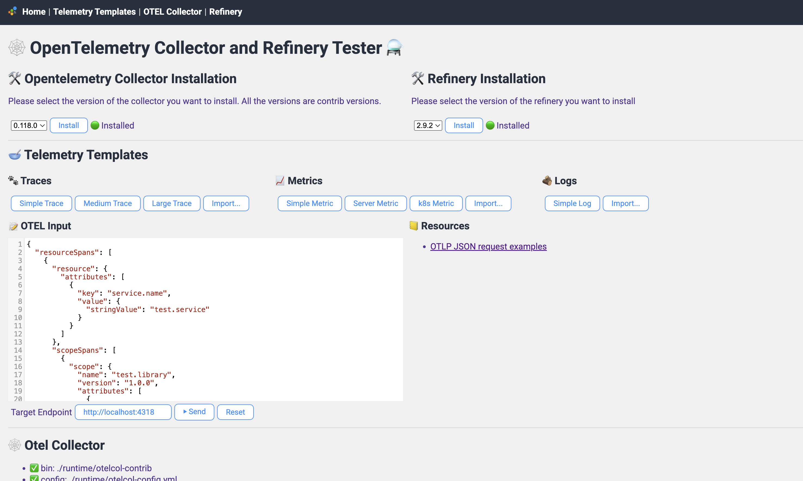

# OpenTelemetry Collector and Refinery Tester

# What is it?
It's a simple web application that allows user to download, install, and test the Opentelemetry Collector, and Honeycomb Refinery together.

# Installation instructions
You can run the application locally using npm, run in the docker, run in the github codepace, or run in the gitpod.

## install zstd
- refinery communicates using zstd, so you need to have zstd library installed

for linux:
```
sudo apt-get install zstd
```
```
sudo apk add zstd
```

for macos:
```
brew install zstd
```

### Additional instructions for MACOS users
- You might encounter the following error when trying to run the tester natively in your MacOS environment:
```
ode:internal/modules/cjs/loader:1925
  return process.dlopen(module, path.toNamespacedPath(filename));
                 ^

Error: dlopen(/Users/howardyoo/Projects/oteltester/node_modules/fast-zstd/build/Release/zstd.node, 0x0001): Library not loaded: /usr/local/lib/libzstd.1.dylib
  Referenced from: <E2C32DF6-8541-38DF-8815-6ED32CCC1627> /Users/howardyoo/Projects/oteltester/node_modules/fast-zstd/build/Release/zstd.node
  Reason: tried: '/usr/local/lib/libzstd.1.dylib' (no such file), '/System/Volumes/Preboot/Cryptexes/OS/usr/local/lib/libzstd.1.dylib' (no such file), '/usr/local/lib/libzstd.1.dylib' (no such file)
```
- In that case, link the zstd dylib to the path that npm looks for. Somehow, in macos, npm tries to look for the dylib in `/usr/local/lib/libzstd.1.dylib`, but the actual location is in `/opt/homebrew/Cellar/zstd/1.5.x/lib/libzstd.1.dylib` (since have installed libzstd using brew). The version number `x` can vary, so set it accordingly as such:

```
sudo ln -s /opt/homebrew/Cellar/zstd/1.5.6/lib/libzstd.1.5.6.dylib /usr/local/lib/libzstd.1.dylib
```

# Running the application locally
- install the dependencies using npm:
```
npm install
```
- run the application using npm:
```
npm run
```
or
```
npm run dev
```

# Running the application in docker
Make sure you have docker installed.
run the following command to start the application:

```
./run.sh
```

To stop the application, run the following command:
```
./stop.sh
```

# Accessing the application
- use the browser to access the application at `http://localhost:3000/`

# Using Tester

## About OTEL JSON data
- OTEL JSON data can be of three types: trace, metric, and log.
- Their format is different, and you can find more details in the following links:
  - [OTEL specification](https://github.com/open-telemetry/opentelemetry-specification/blob/main/specification)
  - [OTEL trace example](https://raw.githubusercontent.com/open-telemetry/opentelemetry-proto/refs/heads/main/examples/trace.json)
  - [OTEL metric example](https://raw.githubusercontent.com/open-telemetry/opentelemetry-proto/refs/heads/main/examples/metrics.json)
  - [OTEL log example](https://raw.githubusercontent.com/open-telemetry/opentelemetry-proto/refs/heads/main/examples/logs.json)

## Sending multiple data
- OTEL does not allow containing different types of data in a single message.
- However, there are cases where having multiple types of data in a single message is useful, and Tester supports this by allowing user to send multiple messages in a single request.
- When user sends multiple messages, Tester will send them to the collector in a series of requests, each containing only one type of data.
- Combining data in a single message can be done by having a JSON array [ ] at the root of the message, and having the actual data as elements of the array.
- For example, if user wants to send a trace and a metric, the message should look like the following:
```JSON
[
  {
    "resourceTrace": {...}
  },
  {
    "resourceMetric": {...}
  },
  {
    "resourceLog": {...}
  }
]
```
- When user sends this message, Tester will iterate through the array and process each element as a separate message, and submit them to the collector in order of appearance.
- ⚠️ Note, however, that this message is NOT a valid OTEL JSON message format.
- There is another way you can send messages in a single JSON.
```JSON
{
  "resourceTrace": {...},
  "resourceMetric": {...},
  "resourceLog": {...}
}
```
- This method is also supported. However, note that this is not a VALID OTEL JSON format.

## How to set time for the data
- Often times, it is not useful to use what was contained inside the OTEL JSON data's timestamps (which is in UNIX nano seconds).
- Therefore, tester would recognize the following conventions
  - Any time lower than the current time will be considered as the relative time from the current time.
  - The largest time will be used as the current time.
  - The time can have a unit of (ms, s, m, h)
  - The time can be in floating number (e.g. 0.5s, 1.5ms)
  - For example, if user sets the start time to 0, and set the end time to 1s, then the span will have 1 second of duration.
    - Then, if there is a span event that has the timestamp of 0.5s, it will be in the middle of the span.

## Re-creating trace and span id
- In the UI, by default, the original trace and span id will be re-placed by new ones (you can optionally disable it).
- Also, you can use a special placeholder such as `{{trace.1}}` or `{{span.1}}` to refer to the trace id or span id, such that it can later be used as variables in the other data.
  - this is useful when you want to create a parent and child relationship between telemetries (e.g. parent span and child span or parent span and child log).

## Using OpenAI LLM
- Tester is now capable of using the OpenAI LLM to help generate the OTEL JSON message and OTEL collector configuration.
- In order to use it, create .env file in the root directory and add the following:
```
OPENAI_API_KEY=<your-openai-api-key>
OPENAI_MODEL=<your-openai-model>
```
- You can get the OpenAI API key from [here](https://platform.openai.com/api-keys)
- You can get the OpenAI model from [here](https://platform.openai.com/docs/models)
- You can also use .env.development and run `npm run dev` to use it locally.
- Using the LLM API is optional, and if the proper API key and model are not set, the application will not display the LLM features.
